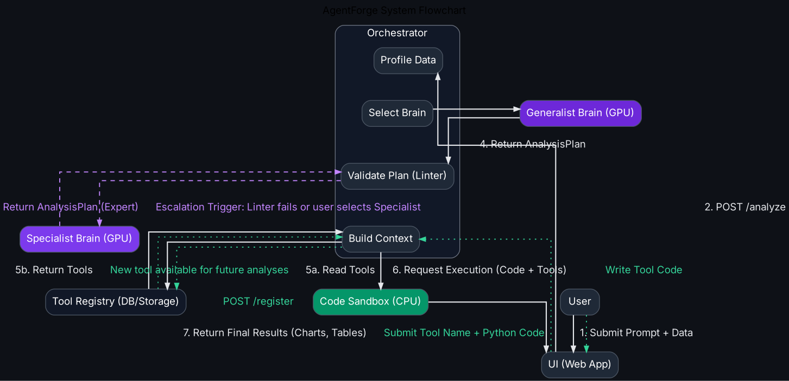

# **AgentForge - The Specialist Agent Platform**

AgentForge is a platform for creating, training, and deploying autonomous AI agents that specialize in domain-specific data analysis. We transform generalist Large Language Models into expert analysts that can reason, plan, write, and execute code to solve complex problems on messy, real-world data.

This repository contains the complete code for the AgentForge **Orchestrator** backend service and the **Flask UI** frontend.

  

## **Core Features**

*   **Autonomous Analysis:** Users submit high-level goals; the agent generates a structured plan, writes Python code, and executes it in a secure sandbox to produce charts and insights.
*   **Specialist "Brains" (LoRA):** Swap between a generalist AI and a fine-tuned specialist (e.g., Financial Analyst) to demonstrate a clear "intelligence gap" in reasoning and capability.
*   **Persistent Tool Registry:** The platform's intelligence compounds. Agents can register new, reusable Python functions as "tools" that become permanently available for future analyses.
*   **On-Demand Training:** A built-in UI to kick off new LoRA training jobs on RunPod, enabling the creation of new specialists on the fly.
*   **Live Updates:** A responsive UI built with HTMX and SSE provides a seamless experience with live training logs and real-time status updates.

## **Technical Architecture**

The system is a multi-component, service-oriented architecture designed to run on **RunPod**.

*   **Orchestrator (`orchestrator.py`):** A FastAPI backend that serves as the central nervous system. It handles:
    *   API routing and business logic.
    *   Managing the state of datasets and the Tool Registry via file-based persistence (in `./state`).
    *   A robust AST-based linter for validating LLM-generated code.
    *   A secure, multiprocessing-based sandbox for code execution with resource limits.
    *   (Stubbed) orchestration of training jobs.
*   **UI (`app.py`):** A lightweight Flask and Jinja2 frontend.
    *   Uses **HTMX** for partial-page updates, providing a responsive feel without a heavy JavaScript framework.
    *   Uses **Server-Sent Events (SSE)** for real-time, non-polling updates for training logs and status.
*   **LLM Brains (External):** The Orchestrator is designed to call external, vLLM-powered serverless endpoints on RunPod for the Generalist and Specialist models.
*   **Data Persistence:** Application state (tools, datasets) is stored in JSON files in the `./state` directory, and uploaded datasets are stored in `./data`. This file-based approach is simple, robust, and compatible with RunPod Volumes.

## **Local Development Setup**

This project is designed to be run locally with a mock backend for rapid development.

### **Prerequisites**

*   Python 3.10+
*   `pip` and `venv`

### **Installation**

1.  **Clone the repository:**
    ```bash
    git clone https://github.com/your-username/agentforge.git
    cd agentforge
    ```

2.  **Create and activate a virtual environment:**
    ```bash
    python -m venv .venv
    # On macOS/Linux:
    source .venv/bin/activate
    # On Windows (PowerShell):
    # .\.venv\Scripts\Activate.ps1
    ```

3.  **Install dependencies:**
    ```bash
    pip install -r requirements.txt
    ```

### **Running the Application**

You need to run the **Orchestrator** and the **UI** in two separate terminals.

**Terminal 1: Start the Orchestrator**
```bash
# The orchestrator will create and manage state in ./state, ./data, and ./logs
python orchestrator.py
```
> The Orchestrator will start on `http://127.0.0.1:8001`.

**Terminal 2: Start the Flask UI**
```bash
# Set the environment variable to point the UI to the orchestrator
# On macOS/Linux:
export ORCHESTRATOR_URL="http://127.0.0.1:8001"

# On Windows (PowerShell):
# $env:ORCHESTRATOR_URL="http://127.0.0.1:8001"

python app.py
```
> The UI will be available at `http://127.0.0.1:5000`.

Open `http://127.0.0.1:5000` in your web browser to use the application.

## **Project Structure**

```
.
├── orchestrator.py         # Main FastAPI backend service
├── app.py                  # Flask frontend UI
├── orchestrator_client.py  # Python client for the orchestrator API
├── mock_orchestrator.py    # (Optional) A simpler mock for UI testing
├── requirements.txt        # Python dependencies
├── .gitignore
│
├── data/                   # Storage for uploaded datasets
│   └── sales_q3.jsonl
│
├── state/                  # Persistent application state
│   ├── datasets.json
│   └── tools.json
│
├── logs/                   # Directory for training job logs
│
├── static/                 # CSS and JavaScript for the UI
│   ├── style.css
│   └── main.js
│
└── templates/              # Jinja2 HTML templates for the UI
    ├── base.html
    ├── index.html
    └── partials/
        └── ...
```

## **API Reference (Orchestrator)**

The `orchestrator.py` service exposes a REST API that the UI and other clients interact with.

*   `POST /analyze`: The core endpoint. Accepts a prompt, dataset, and brain choice; returns a full analysis.
*   `GET /loras`: Lists available specialist brains.
*   `GET /datasets`: Lists available datasets.
*   `POST /datasets/upload`: Uploads a new dataset file.
*   `GET /datasets/{id}/preview`: Returns the first N rows of a dataset.
*   `GET /tools`: Lists registered tools.
*   `POST /tools/register`: Adds a new tool to the registry.
*   `POST /train`: Kicks off a new (mock) training job.
*   `GET /train/{id}/status`: Gets the status and logs for a training job.

## **Deployment on RunPod (Haven't yet implemented, purely conceptual)**

*   **Orchestrator:** Deploy `orchestrator.py` as a **RunPod Serverless CPU Endpoint**. Mount a **Network Volume** to `./state` and `./data` to ensure persistence.
*   **UI:** Deploy `app.py` as another **RunPod Serverless CPU Endpoint**.
*   **LLM Brains:** Deploy two **RunPod Serverless GPU Endpoints** (one for the base model, one for the specialist LoRA) using a vLLM template.
*   **Sandbox:** Although the current orchestrator uses `multiprocessing`, a production version would call out to a dedicated **RunPod On-Demand Pod** for sandboxed execution to ensure full isolation.

